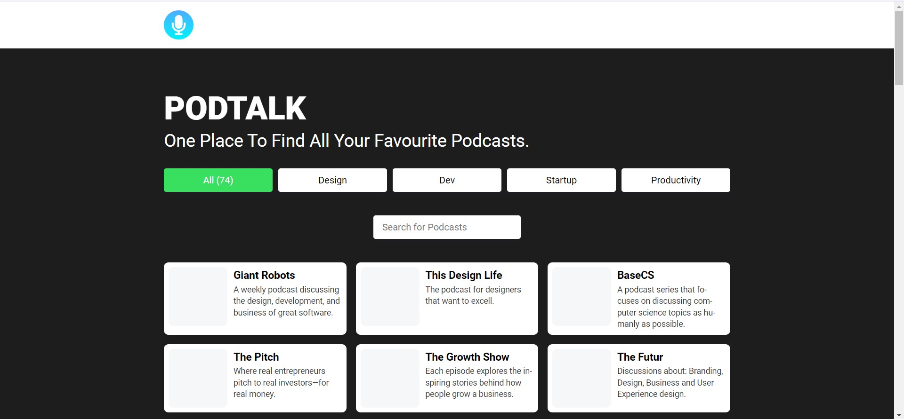

# PODTALK
One place to find all your favourite podcasts.

# INTRODUCTION
A podcast website is a platform that hosts and distributes audio content in the form of podcasts. Podcasts are digital audio files that users can download or stream on demand to their computers.

The website typically includes a home page that features the latest episodes, as well as links to past episodes and show notes. Show notes are summaries of the podcast episode, including the topics covered and any guests featured.

Users can browse the website to discover new podcasts based on category or topic, or search for specific episodes or shows. podcast websites also include a community section, where users can interact with hosts and other listeners, leave comments and feedback, or participate in discussions.

Podcast websites are an essential tool for podcasters to reach a wider audience, as they provide a central hub for listeners to access their content. 

